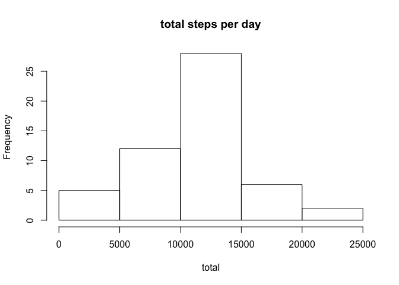
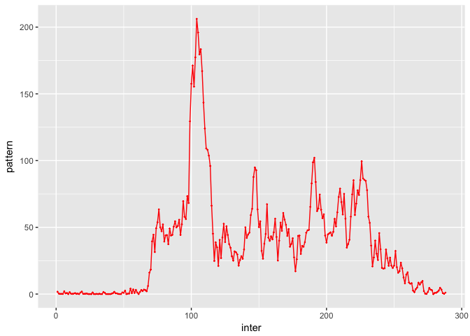
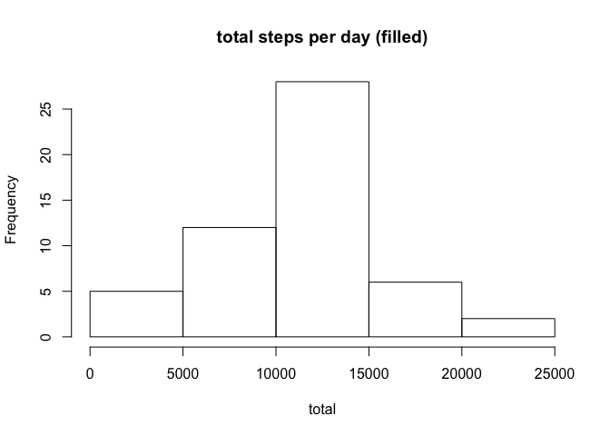
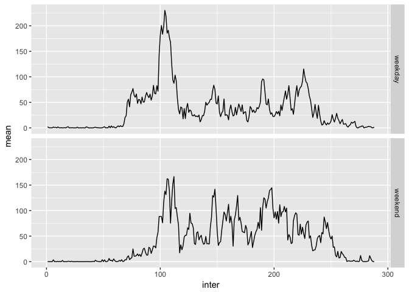

## Loading and preprocessing the data

```r
library(ggplot2)
unzip("activity.zip")
activity<- read.csv("activity.csv",sep=",",header=T)
```
## What is mean total number of steps taken per day?

```r
total<- with(subset(activity, is.na(activity$steps)==F),tapply(steps, date, sum))

hist(total, main="total steps per day")
```

<!-- -->

```r
mean_steps_per_day<- mean(total, na.rm=T)
median_steps_per_day<- median(total, na.rm=T)
```
the  the mean and median total number of steps taken per day are separately1.0766189\times 10^{4} and 10765

## What is the average daily activity pattern?

```r
activity$interval<- as.factor(activity$interval)
pattern<- with(subset(activity, is.na(activity$steps)==F),tapply(steps, interval, mean))

inter<- unique(activity$interval)
Pat<- data.frame(inter, pattern)
Pat$inter<- as.numeric(Pat$inter)
ggplot( Pat, aes(inter, pattern))+
       geom_point(size=0.2,colour="red")+
       geom_path(colour="red")
```

<!-- -->

```r
Max<- subset(Pat, (Pat$pattern== max(Pat$pattern)))
Max$inter
```

```
## [1] 104
```
the  104th contains the maximum number of steps

## Imputing missing values

```r
##calculating the total number of missing values
missing_value<- nrow(subset(activity, is.na(activity$steps)==T))

##creating the filled dataset
filled_activity<- activity
filled_activity$interval<- as.numeric(filled_activity$interval)
for (i in 1:nrow(filled_activity)){
       if( is.na(filled_activity[i,]$steps)==T){
              filled_activity[i,]$steps<- pattern[(filled_activity[i,]$interval)]
           }
}

##ploting new histogram and calculate the mean & median
f_total<- with(filled_activity,tapply(steps, date, sum))

hist(total, main="total steps per day (filled)")
```

<!-- -->

```r
f_mean_steps_per_day<- mean(f_total, na.rm=T)
f_median_steps_per_day<- median(f_total, na.rm=T)

difference<- matrix(c(mean_steps_per_day,f_mean_steps_per_day,median_steps_per_day,f_median_steps_per_day),nrow=2,ncol=2,dimnames=list(c("with_missing_value", "with_filled_value"),c("mean","median")))
difference
```

```
##                        mean   median
## with_missing_value 10766.19 10765.00
## with_filled_value  10766.19 10766.19
```
As we can see the difference of mean and median steps per day between the original and filled in dataset is very slight. So the input value merely influence the estimate. 
## Are there differences in activity patterns between weekdays and weekends?

```r
filled_activity$weekday<- weekdays(as.Date(filled_activity$date))

weekend<- c("星期六","星期日")
for (i in 1:length(filled_activity$weekday)){
       if(filled_activity$weekday[i] %in% weekend ==T){
              filled_activity$weekday[i]<- "weekend"}
       else filled_activity$weekday[i]<- "weekday"
}
head(filled_activity)##indicating the day is weekday or weekend
```

```
##       steps       date interval weekday
## 1 1.7169811 2012-10-01        1 weekday
## 2 0.3396226 2012-10-01        2 weekday
## 3 0.1320755 2012-10-01        3 weekday
## 4 0.1509434 2012-10-01        4 weekday
## 5 0.0754717 2012-10-01        5 weekday
## 6 2.0943396 2012-10-01        6 weekday
```

```r
filled_activity$weekday<- as.factor(filled_activity$weekday)
filled_activity$interval<- as.factor(filled_activity$interval)
weekday<- subset(filled_activity,filled_activity$weekday=="weekday")
weekend<- subset(filled_activity,filled_activity$weekday=="weekend")

##creating the plotting data set
inter<- as.numeric(inter)
mean<- with(weekday,tapply(steps, interval,mean))
weekday<- data.frame(inter,mean)
weekday$dtype="weekday"
mean<- with(weekend,tapply(steps, interval,mean))
weekend<- data.frame(inter, mean)
weekend$dtype="weekend"
week<- rbind(weekday,weekend)

ggplot(week,aes(inter,mean))+
       geom_line()+
       facet_grid(dtype~.)
```

<!-- -->


